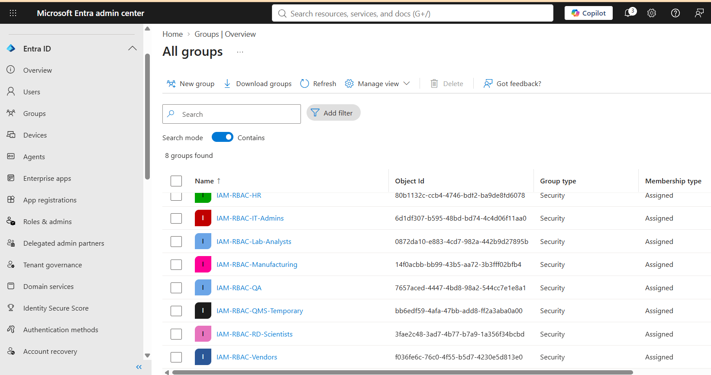
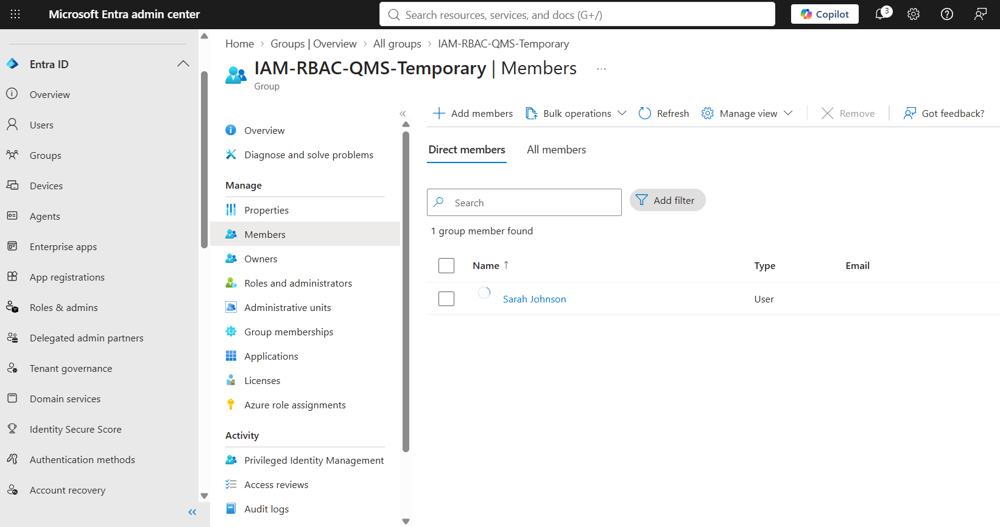
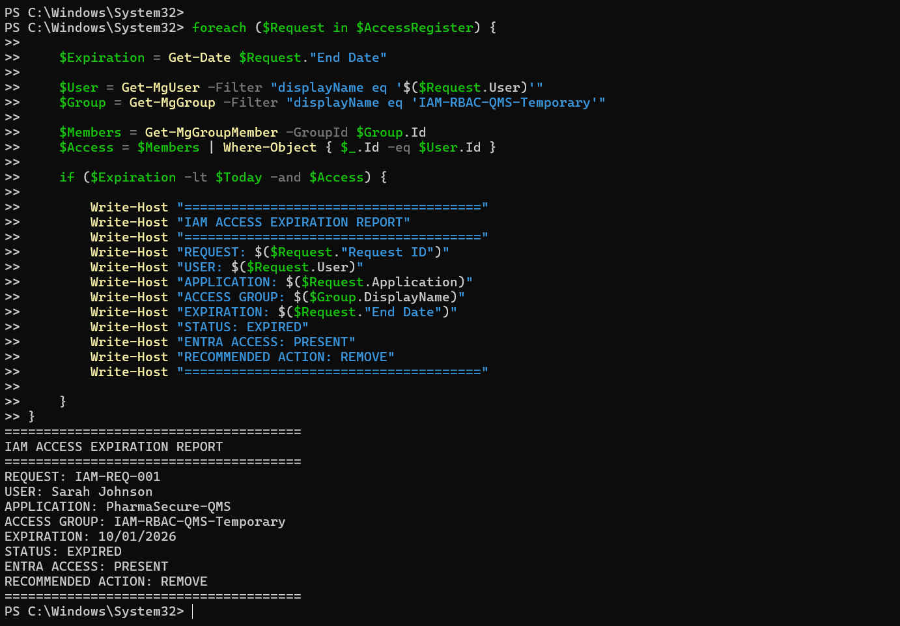
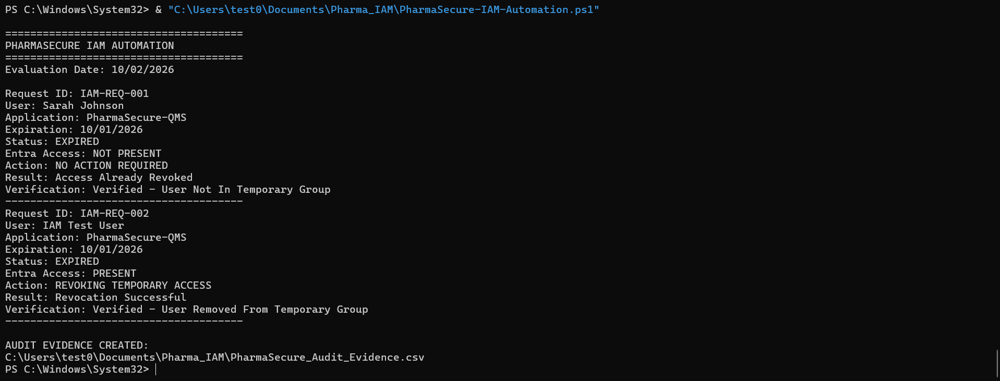
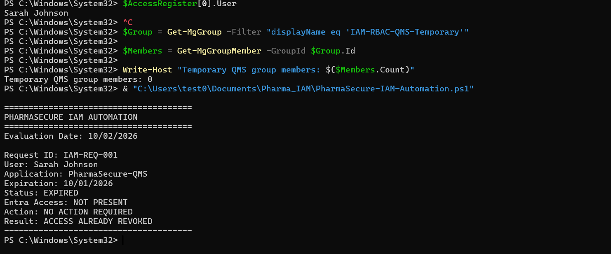
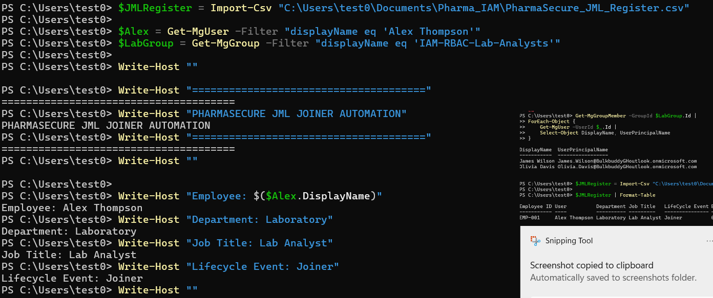
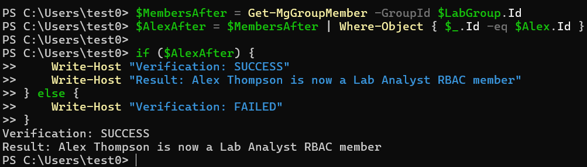
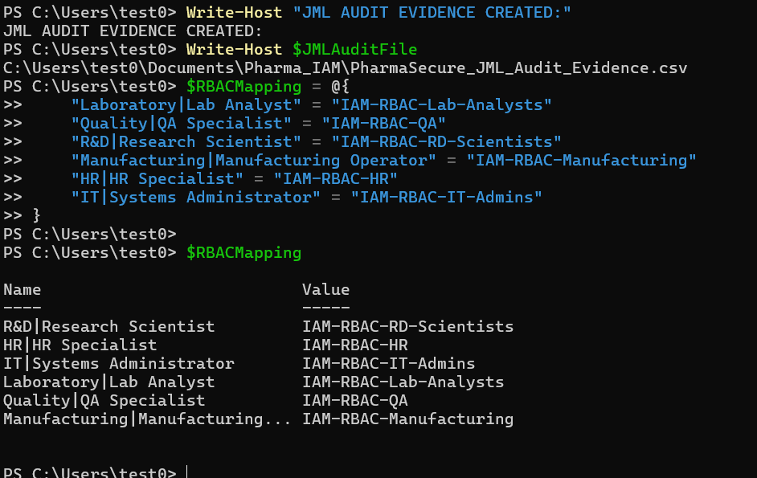
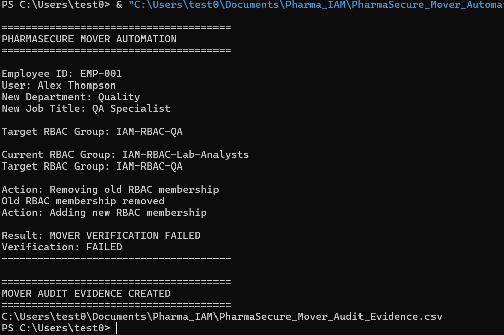
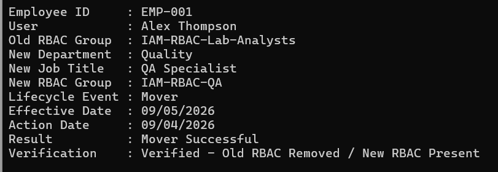

# PharmaSecure IAM Automation Lab

A hands-on Identity and Access Management (IAM) automation project built with **Microsoft Entra ID, Microsoft Graph, and PowerShell**.

PharmaSecure is a fictional pharmaceutical organization used to simulate enterprise IAM operations in a regulated environment. The project demonstrates role-based access control (RBAC), Joiner-Mover lifecycle automation, temporary access governance, automated access revocation, post-change verification, certificate-based Microsoft Graph authentication, fail-safe API handling, and audit evidence generation.

---

## Project Overview

Identity teams must ensure that users receive the right access when they join an organization, have their permissions adjusted when their responsibilities change, and lose temporary or unnecessary access when it is no longer authorized.

This lab automates several of those processes.

The project implements three primary IAM workflows:

### 1. Joiner Provisioning

Processes pending Joiner requests and assigns role-based access according to an employee's department and job title.

### 2. Mover Automation

Processes employee role changes, removes obsolete managed job-role access, preserves unrelated access, and provisions the RBAC membership required for the employee's new role.

### 3. Temporary Access Governance

Evaluates time-limited access, detects expired authorization, removes expired group membership, verifies the resulting access state, and generates audit evidence.

The overall automation pattern is:

```text
Detect -> Evaluate -> Remediate -> Verify -> Record
```

---

## Technologies Used

- Microsoft Entra ID
- Microsoft Graph
- Microsoft Graph PowerShell SDK
- PowerShell
- Entra App Registrations
- X.509 certificate authentication
- Entra security groups
- Role-Based Access Control (RBAC)
- Joiner-Mover lifecycle workflows
- CSV-based IAM access registers
- Automated audit evidence generation

---

## Architecture

The lab uses CSV-based access and lifecycle registers as the source for IAM requests.

PowerShell processes those records and communicates with Microsoft Entra ID through Microsoft Graph.

```text
+---------------------------+
| Access / JML Registers    |
|          (CSV)            |
+-------------+-------------+
              |
              v
+---------------------------+
| PowerShell IAM Automation |
+-------------+-------------+
              |
              v
+---------------------------+
|      Microsoft Graph      |
+-------------+-------------+
              |
              v
+---------------------------+
|    Microsoft Entra ID     |
|                           |
| Users + Security Groups   |
+-------------+-------------+
              |
        +-----+-----+
        |           |
        v           v
  Access Change  Verification
        |           |
        +-----+-----+
              |
              v
+---------------------------+
|      Audit Evidence       |
|           (CSV)           |
+---------------------------+
```

---

# RBAC Model

Security groups were created in Microsoft Entra ID to represent access associated with different organizational roles.

| Department / Role | Entra RBAC Group |
|---|---|
| Laboratory / Lab Analyst | `IAM-RBAC-Lab-Analysts` |
| Quality / QA Specialist | `IAM-RBAC-QA` |
| R&D / Research Scientist | `IAM-RBAC-RD-Scientists` |
| Manufacturing / Manufacturing Operator | `IAM-RBAC-Manufacturing` |
| HR / HR Specialist | `IAM-RBAC-HR` |
| IT / Systems Administrator | `IAM-RBAC-IT-Admins` |
| Temporary QMS Access | `IAM-RBAC-QMS-Temporary` |

The objective is to associate access with defined business roles instead of assigning unrelated permissions directly to individual users.

### Entra RBAC Groups



---

# Temporary Access Governance

`PharmaSecure-IAM-Automation.ps1` evaluates temporary access records and determines whether access has exceeded its approved expiration date.

For each request, the automation:

1. Reads the temporary access register.
2. Evaluates the approved expiration date.
3. Locates the user in Microsoft Entra ID.
4. Locates the temporary QMS security group.
5. Checks current group membership.
6. Determines whether the access is expired.
7. Removes expired access when it remains present.
8. Queries Entra ID again to verify the resulting state.
9. Generates structured audit evidence.

The evaluation date defaults to the current system date. An optional `-EvaluationDate` parameter can be supplied for controlled testing and reproducible lab demonstrations.

This implements the control pattern:

```text
Detect
   |
   v
Evaluate
   |
   v
Remediate
   |
   v
Verify
   |
   v
Record Evidence
```

## Temporary Access Before Revocation

The test identity is shown as a member of the temporary QMS RBAC group before enforcement.



## Expired Access Detection

The access register is evaluated against the current system date by default. An optional evaluation date can be supplied for controlled testing and reproducible lab demonstrations.



## Automated Access Revocation

When expired access remains present, Microsoft Graph is used to remove the identity from the temporary RBAC group.



## Post-Change Verification

The automation does not assume that a directory change succeeded.

After processing the access state, Entra ID is queried again so that the resulting membership can be validated and recorded.



---

# Joiner Lifecycle Automation

`PharmaSecure_Joiner_Automation.ps1` processes pending Joiner requests from the JML register and determines the appropriate RBAC group based on the employee's department and job title.

The workflow:

1. Reads pending Joiner requests.
2. Reads the employee's department and job title.
3. Maps the role to an approved RBAC group.
4. Locates the identity in Microsoft Entra ID.
5. Locates the required Entra security group.
6. Checks whether the required access already exists.
7. Provisions group membership when necessary.
8. Queries Entra ID again to validate the resulting state.
9. Generates audit evidence.

Example:

```text
Alex Thompson
      |
      v
Laboratory
Lab Analyst
      |
      v
IAM-RBAC-Lab-Analysts
```

The workflow is designed to handle an already-provisioned identity. If the required membership is already present, the automation records the existing state rather than attempting to create duplicate access.

Graph lookup, provisioning, and verification failures are recorded separately from legitimate IAM states so that a technical failure cannot be interpreted as a valid access decision.

## Joiner Automation

The Joiner workflow evaluates the employee's department and job title and maps the identity to the appropriate Entra ID RBAC group.



## Joiner Verification

After processing, the resulting group membership is checked to validate the user's access state.



---

# Mover Lifecycle Automation

`PharmaSecure_Mover_Automation.ps1` processes pending Mover events from the JML register.

When an employee changes roles, obsolete job-role access should be removed and access appropriate to the new role should be provisioned without unintentionally removing unrelated or special-purpose access.

Example:

```text
              Alex Thompson
                    |
                    v
         Laboratory / Lab Analyst
                    |
                    v
         IAM-RBAC-Lab-Analysts
                    |
               MOVER EVENT
                    |
                    v
          Quality / QA Specialist
                    |
                    v
               IAM-RBAC-QA
```

The Mover automation:

1. Reads pending Mover requests.
2. Maps the employee's new department and job title to an approved RBAC group.
3. Locates the identity in Microsoft Entra ID.
4. Retrieves the user's current IAM RBAC memberships.
5. Identifies obsolete memberships only within the defined job-role RBAC scope.
6. Preserves unrelated and special-purpose access.
7. Removes obsolete managed job-role memberships.
8. Checks whether the target RBAC membership already exists.
9. Provisions the target RBAC membership when necessary.
10. Queries Entra ID again to verify the final authorization state.
11. Records the lifecycle operation in structured audit evidence.

The workflow is designed to be idempotent and scoped to explicitly managed job-role groups. Special-purpose access, such as temporary QMS access, is intentionally excluded from Mover revocation logic.

## RBAC Role Mapping

The automation uses a department and job-title mapping table to determine the appropriate RBAC group.



## Mover Automation

The Mover workflow transitions the user's managed job-role access to the group associated with the new role while preserving access outside the workflow's defined scope.



## Mover Audit Evidence

The lifecycle operation is recorded in structured audit evidence for traceability and review.



---

# Microsoft Graph Integration

The automation interacts with Microsoft Entra ID through the **Microsoft Graph PowerShell SDK**.

Graph operations used by the project include:

```powershell
Get-MgUser
Get-MgGroup
Get-MgGroupMember
Get-MgUserMemberOf
New-MgGroupMemberByRef
Remove-MgGroupMemberByRef
```

These operations allow the scripts to:

- Locate identities
- Locate RBAC security groups
- Inspect existing memberships
- Provision access
- Revoke access
- Query resulting access states

Graph-dependent operations use structured error handling so that API, authentication, permission, or connectivity failures are treated as technical failures rather than valid IAM states.

---

# Certificate-Based Authentication

The lab uses a Microsoft Entra application registration with **X.509 certificate-based authentication** for Microsoft Graph.

This avoids storing passwords or client secrets directly inside the automation scripts.

Example authentication pattern:

```powershell
Connect-MgGraph `
    -ClientId $ClientId `
    -TenantId $TenantId `
    -CertificateThumbprint $CertificateThumbprint
```

The certificate and private key are intentionally **not stored in this repository**.

The automation also checks for an existing Microsoft Graph context before performing IAM operations.

Example:

```powershell
$GraphContext = Get-MgContext

if (-not $GraphContext) {
    Write-Error "Microsoft Graph authentication required. Connect to Microsoft Graph before running this automation."
    exit 1
}
```

This prevents the scripts from intentionally proceeding when no Microsoft Graph authentication context exists.

---

# Audit Evidence

Each workflow generates structured CSV evidence documenting the IAM operation.

Depending on the workflow, evidence includes fields such as:

- Request ID
- Employee ID
- User
- Department
- Job title
- Application
- Access type
- Lifecycle event
- Previous RBAC group
- New RBAC group
- Expiration date
- Effective date
- Evaluation or action date
- Automation result
- Verification result

The evidence demonstrates how IAM automation can provide repeatable records for operational review, access governance, troubleshooting, and compliance-oriented processes.

Example lifecycle:

```text
IAM Request
     |
     v
Policy / RBAC Evaluation
     |
     v
Microsoft Graph Action
     |
     v
Post-Change Query
     |
     v
Audit Evidence
```

---

# Security Controls Demonstrated

## Role-Based Access Control

Department and job-title combinations are mapped to defined Microsoft Entra security groups.

## Least Privilege

Access is associated with the user's business role rather than being assigned without role context.

Mover processing removes obsolete managed job-role access while preserving access outside the workflow's defined scope.

## Identity Lifecycle Management

Joiner and Mover events drive role-based access decisions.

## Time-Bound Access

Temporary QMS access contains an expiration date that can be evaluated automatically.

## Automated Revocation

Expired temporary access can be removed through Microsoft Graph when it remains present after its approved expiration date.

## Post-Change Verification

IAM operations are followed by directory queries to evaluate the resulting access state.

## Auditability

Automation results are exported to structured evidence files.

## Credential Security

Certificate-based application authentication avoids embedding passwords or client secrets in the PowerShell source code.

---

# Security & Design Decisions

The automation was designed to demonstrate IAM engineering principles beyond basic user and group administration.

## Fail-Safe Microsoft Graph Operations

Microsoft Graph operations use terminating error handling and structured `try/catch` blocks.

API failures, permission issues, authentication problems, or connectivity errors are treated as technical failures rather than legitimate IAM states.

This prevents a failed Graph query from being incorrectly interpreted as evidence that a user does not have access.

## Idempotent Access Management

The Joiner and Mover workflows check existing group membership before assigning access.

If the required RBAC membership already exists, the automation records the existing state rather than attempting a duplicate assignment.

This allows workflows to be safely rerun while reducing unnecessary directory changes.

## Scoped RBAC Management

The Mover workflow manages only explicitly defined job-role RBAC groups:

- `IAM-RBAC-Lab-Analysts`
- `IAM-RBAC-QA`
- `IAM-RBAC-RD-Scientists`
- `IAM-RBAC-Manufacturing`
- `IAM-RBAC-HR`
- `IAM-RBAC-IT-Admins`

Special-purpose access such as `IAM-RBAC-QMS-Temporary` is outside the Mover workflow's managed job-role scope.

This prevents a role change from unintentionally removing unrelated or temporary access.

## Least-Privilege Mover Workflow

When an employee changes roles, the automation:

1. Determines the target RBAC group from the approved department/job-title mapping.
2. Identifies obsolete managed job-role memberships.
3. Removes obsolete job-role access.
4. Adds the required target role if it is not already present.
5. Queries Entra ID again to verify the final authorization state.
6. Records the result in audit evidence.

This demonstrates automated enforcement of role-based access and least-privilege principles during identity lifecycle changes.

## Post-Change Verification

Successful API execution alone is not considered sufficient evidence of a successful IAM change.

After provisioning or revocation, the automation queries Microsoft Entra ID again and validates the resulting membership state before recording the operation as successful.

## Dynamic Temporary Access Evaluation

Temporary-access governance uses the current system date by default rather than relying on a permanently hardcoded evaluation date.

A custom evaluation date can also be supplied for testing or reproducible lab demonstrations:

```powershell
.\automation\PharmaSecure-IAM-Automation.ps1 -EvaluationDate "2026-10-02"
```

This allows the same automation to support both normal execution and controlled testing scenarios.

## Audit Evidence

Each workflow generates structured CSV audit evidence containing relevant identity, role, lifecycle, action, result, and verification information.

The goal is to demonstrate traceability suitable for access reviews, troubleshooting, and audit-support scenarios.

## Certificate-Based Authentication

Microsoft Graph access is performed through an Entra ID application using certificate-based authentication rather than embedding credentials or client secrets in the scripts.

Sensitive authentication material such as private keys, certificates, tenant-specific configuration, and secrets is excluded from the repository.

---

# Repository Structure

```text
Pharma_IAM/
|
+-- automation/
|   |
|   +-- PharmaSecure-IAM-Automation.ps1
|   +-- PharmaSecure_Joiner_Automation.ps1
|   +-- PharmaSecure_Mover_Automation.ps1
|
+-- evidence/
|   |
|   +-- PharmaSecure_Access_Register.csv
|   +-- PharmaSecure_Audit_Evidence.csv
|   +-- PharmaSecure_JML_Register.csv
|   +-- PharmaSecure_JML_Audit_Evidence.csv
|   +-- PharmaSecure_Mover_Audit_Evidence.csv
|
+-- screenshots/
|   |
|   +-- 01-entra-rbac-groups.png
|   +-- 02-temporary-access-before.png
|   +-- 03-expired-access-detection.png
|   +-- 04-access-revocation.png
|   +-- 05-access-revocation-verification.png
|   +-- 06-rbac-role-mapping.png
|   +-- 07-mover-automation.png
|   +-- 08-mover-audit-verification.png
|   +-- 09-joiner-automation.png
|   +-- 10-joiner-verification.png
|
+-- .gitignore
+-- README.md
```

---

# Portable Project Paths

The PowerShell scripts use `$PSScriptRoot` rather than hardcoded local machine paths.

Example:

```powershell
$ProjectRoot = Split-Path $PSScriptRoot -Parent

$JMLFile = Join-Path $ProjectRoot "evidence\PharmaSecure_JML_Register.csv"
```

This allows the repository to be cloned to another directory without requiring hardcoded paths such as:

```text
C:\Users\<username>\Documents\...
```

to be rewritten.

---

# Running the Lab

## Prerequisites

The environment requires:

- PowerShell
- Microsoft Graph PowerShell SDK
- Microsoft Entra ID tenant
- Microsoft Entra application registration
- X.509 certificate
- Appropriate Microsoft Graph application permissions
- Test users
- Entra security groups

Microsoft Graph authentication must be established before running the IAM workflows.

Example:

```powershell
$ClientId = "<APPLICATION-CLIENT-ID>"
$TenantId = "<DIRECTORY-TENANT-ID>"
$CertificateThumbprint = "<CERTIFICATE-THUMBPRINT>"

Connect-MgGraph `
    -ClientId $ClientId `
    -TenantId $TenantId `
    -CertificateThumbprint $CertificateThumbprint
```

These values should be supplied from the local environment and should **not** be committed to the repository.

---

## Run Temporary Access Governance

From the repository root:

```powershell
.\automation\PharmaSecure-IAM-Automation.ps1
```

By default, the current system date is used to evaluate expiration.

For a controlled test using a specific evaluation date:

```powershell
.\automation\PharmaSecure-IAM-Automation.ps1 -EvaluationDate "2026-10-02"
```

---

## Run Joiner Automation

```powershell
.\automation\PharmaSecure_Joiner_Automation.ps1
```

---

## Run Mover Automation

```powershell
.\automation\PharmaSecure_Mover_Automation.ps1
```

Audit output is written to the project's `evidence` directory.

---

# Key Takeaways

This project demonstrates hands-on experience with:

- Identity and Access Management
- Microsoft Entra ID administration
- Microsoft Graph integration
- PowerShell IAM automation
- Role-Based Access Control
- Joiner provisioning
- Mover access transitions
- Identity lifecycle management
- Temporary access governance
- Automated access revocation
- Least-privilege access management
- Idempotent IAM automation
- Fail-safe API error handling
- Post-change access validation
- Certificate-based authentication
- Audit evidence generation
- Security controls in a simulated regulated environment

The project was designed to move beyond manual IAM administration and demonstrate how identity processes can be implemented as repeatable, verifiable, and auditable automation workflows.

---

# Disclaimer

**PharmaSecure is a fictional organization created for an IAM engineering lab.**

The identities, employee records, access requests, business scenarios, and organizational structure shown in this repository are synthetic and are used solely for technical demonstration and portfolio purposes.

No production environment, production credentials, private keys, or real pharmaceutical systems are included in this repository.